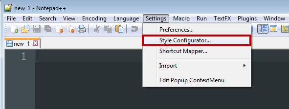
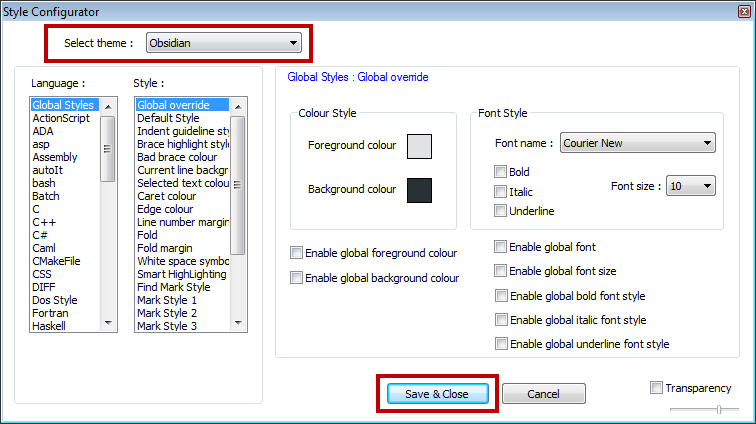
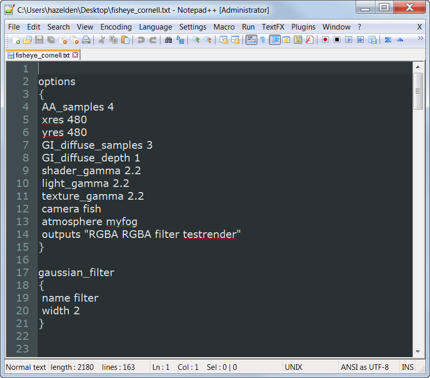

# Notepad++ Arnold Syntax Highlighter  #
**Version 1** Released November 29, 2013   
by Andrew Hazelden

## Overview ##
I would like to present a new Notepad++ syntax highlighting module that works with code from [Solid Angle's Arnold Renderer](http://www.solidangle.com/). The new module makes it easier for a VFX Artist or Technical Director to edit an Arnold scene source (.ass) file.

**Note:** The free program Notepad++ is required to use the syntax highlighter.

## Download ##

The Arnold Syntax Highlighter module is a free download.

You can download the latest version on GitHub here:   
[https://github.com/AndrewHazelden/Arnold-Syntax-Highlighter/](https://github.com/AndrewHazelden/Arnold-Syntax-Highlighter/)

## Installation ##

**Step 1.**  [Download Notepad++](http://notepad-plus-plus.org/download/v6.4.5.html) and install it on your system. After you start Notepad++ you will see a blank text editing window.

**Step 2.**  The syntax highlighting module has been customized to work with the dark background based **Obsidian** theme. To load the Obsidian theme in Notepad++, go to the **Settings** menu and select **"Style Configurator..."**

In the Style Configurator window select the **Obsidian** theme and click the **Save and Close** button. 

**Step 3.** Let's load the custom "Arnold" syntax highlighting module. Open the **Language** menu in Notepad++ and select the **"Define your language..."** menu item. The **User Defined Language** window will load.

**Step 4.** In the **User Defined Language** window, click on the **Import** button to load the XML based language file.

In the open dialog select the **"userDefined_Arnold.xml"** file and click **open**.

If the file was loaded correctly an "Import Successful" notice will appear.  Click the **OK** button to continue. At this point you should close the "User Defined Language" widow by clicking on the window's **X** shaped close button.

**Step 5.**  We need to restart Notepad++ for the new language module to be listed in the Notepad++ language menu.

If you open an Arnold scene source .ass file at this point you will see formatted text. If you are working on an include file without the .ass extension you can select the language manually.

Open the **Language** menu and select **Arnold**. This will turn on syntax highlighting and make it easier to develop complex Arnold scene files.
 

Here is an example Arnold .ass file with Notepad++ based syntax highlighting enabled:

* * *

I hope this tool improves your coding workflow as you develop new Arnold scene source files using the Notepad++ text editor. I've also created an Arnold syntax highlighter for gedit, BBEdit, and TextWrangler.

Cheers,  
Andrew Hazelden

Email: [andrew@andrewhazelden.com](mailto:andrew@andrewhazelden.com)   
Blog: [http://www.andrewhazelden.com](http://www.andrewhazelden.com)  
Twitter: [@andrewhazelden](https://twitter.com/andrewhazelden)  
Google+: [https://plus.google.com/+AndrewHazelden](https://plus.google.com/+AndrewHazelden)

