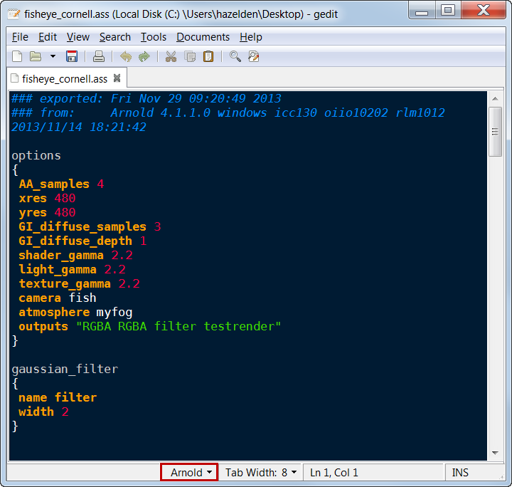
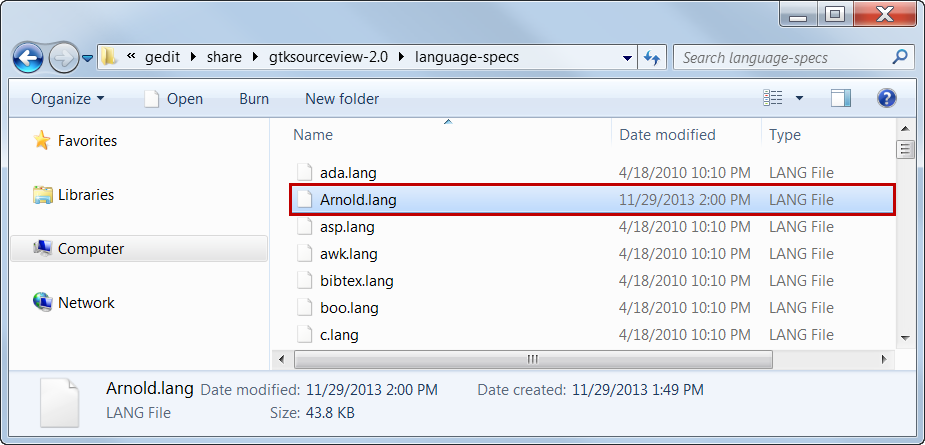
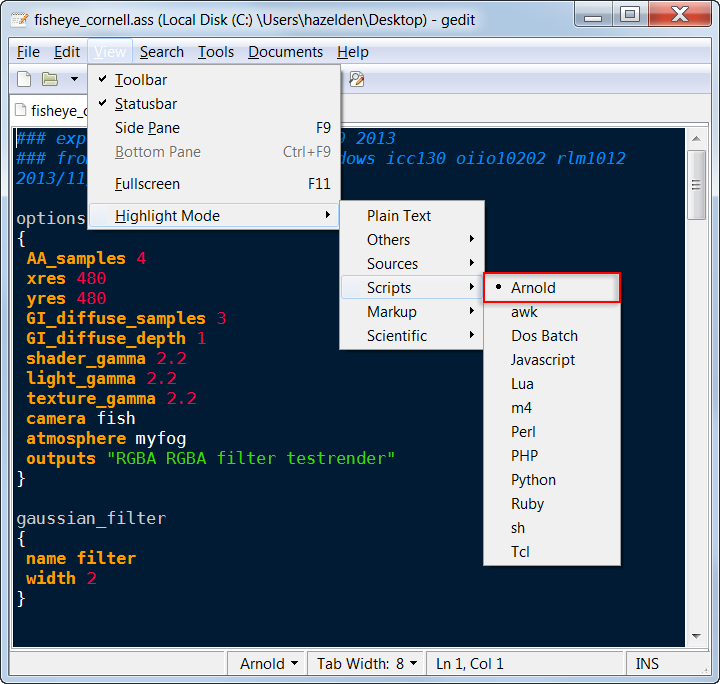
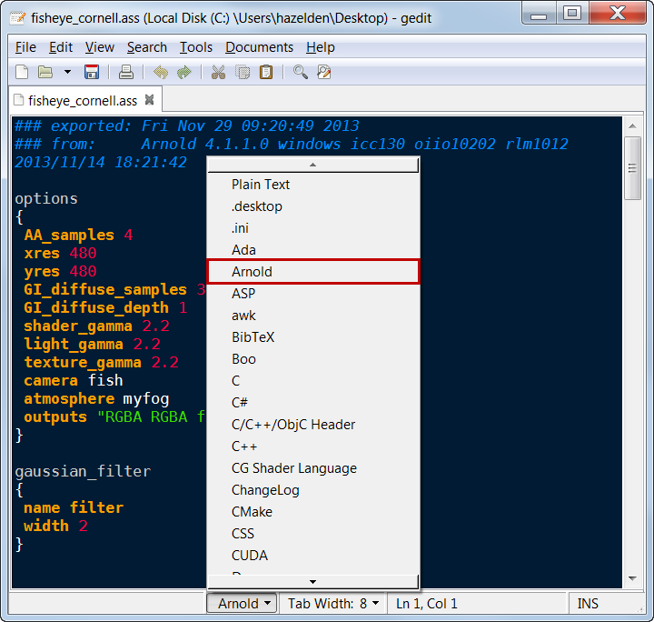
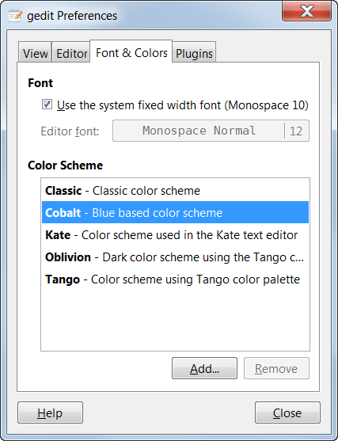
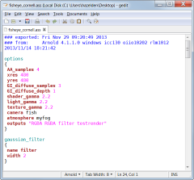
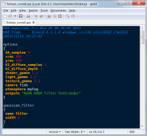
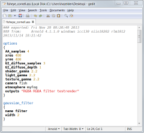
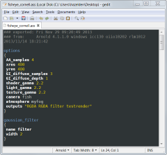
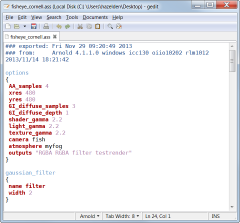

# gedit Arnold Syntax Highlighter  #
**Version 1.4** Released 2016-12-16
by Andrew Hazelden

## Overview ##
I would like to present a new gedit syntax highlighting module that works with code from [Solid Angle's Arnold Renderer](http://www.solidangle.com/). The new module makes it easier for a VFX Artist or Technical Director to edit an Arnold scene source (.ass) and Arnold Metadata (.mtd) files.

**Note:** The opens source program gedit is required to use the syntax highlighter. The gedit text editor is available for Linux, Windows, and Mac OS X systems.

## Download ##

The Arnold Syntax Highlighter module is a free download.

You can download the latest version on GitHub here:   
[https://github.com/AndrewHazelden/Arnold-Syntax-Highlighter/](https://github.com/AndrewHazelden/Arnold-Syntax-Highlighter/)

## Installation ##

**Step 1.**  [Download gedit](https://projects.gnome.org/gedit/) and install it on your system. If you are on Linux you already have a copy of gedit on you system. After you start gedit you will see a blank text editing window.

**Step 2.**  Copy the **Arnold.lang** and **ArnoldMetadata.lang** files to your gedit language-specs folder.

On Windows you need to copy the Arnold.lang and ArnoldMetadata.lang files to the **language-specs** folder located at:

    `C:\Program Files (x86)\gedit\share\gtksourceview-2.0\language-specs\`  
or  

    `C:\Program Files\gedit\share\gtksourceview-2.0\language-specs\`  
  
On Linux you need to copy the Arnold.lang and ArnoldMetadata.lang files to the language-specs folder located at:

     `/usr/local/share/gtksourceview-2.0/language-specs/`
  
or  

     `/usr/share/gtksourceview-2.0/language-specs/`  

or you can place the .lang files in your home folder at:

	`~/.local/share/gtksourceview-2.0/language-specs/`
     
**Step 3.**  We need to restart gedit for the new language modules to be listed in the gedit **Highlighter Mode** menu. Let's check if the script was installed correctly by opening the menu **View > Highlighter Mode > Scripts > Arnold**.

If you open an Arnold scene source .ass file at this point you will see formatted text. If you are working on an Arnold file without the .ass extension you can select the language manually.

Let's manually enable the Arnold compatible syntax highlighting module. Open the **Language** menu on the bottom right of the window and select **Arnold**. This will turn on syntax highlighting and make it easier to develop complex Arnold scene files.
 

## Color Schemes ##
If you are new to gedit you will probably want to pick a color scheme to customize your work environment. You can switch the current color scheme by opening the **Edit** menu, and selecting **Preferences**. In the gedit Preferences window, click on the **Font & Colors** tab.

Clicking on the color scheme's name with switch between the different syntax highlighting color styles.

## Color Scheme Gallery ##

Gedit comes with 5 colors schemes by default:  

- Classic
- Cobalt
- kate
- Oblivion
- Tango

* * *

I hope the Arnold syntax highlighter improves your coding workflow as you develop new Arnold scene source files using the excellent gedit text editor. I've also created an Arnold syntax highlighter for Notepad++, BBEdit, and TextWrangler.

Cheers,    
Andrew Hazelden

Email: [andrew@andrewhazelden.com](mailto:andrew@andrewhazelden.com)   
Blog: [http://www.andrewhazelden.com](http://www.andrewhazelden.com)  
Twitter: [@andrewhazelden](https://twitter.com/andrewhazelden)  
Google+: [https://plus.google.com/+AndrewHazelden](https://plus.google.com/+AndrewHazelden)
