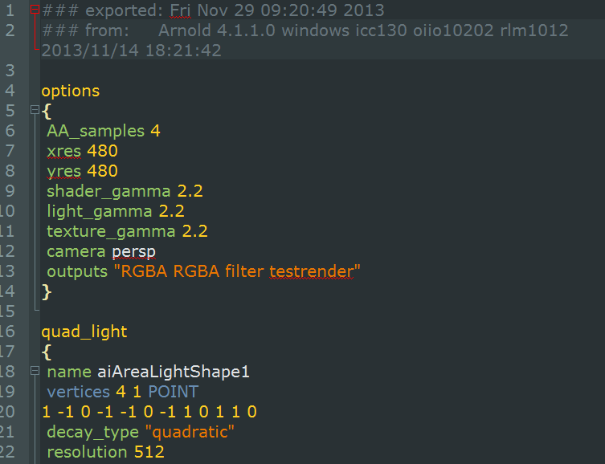

# Arnold Syntax Highlighter #
**Version 1** Released November 29, 2013  
by Andrew Hazelden

## Overview ##

I've just finished a set of Notepad++, GEDIT, BBEdit, and TextWrangler syntax highlighting modules for code from [Solid Angle's Arnold Renderer](http://www.solidangle.com/). The new modules makes it easier for a VFX artist or technical director to edit an Arnold scene source (.ass) file.

* * *

I hope this tool improves your coding workflow as you start working with Arnold.

Cheers,  
Andrew Hazelden

Email: [andrew@andrewhazelden.com](mailto:andrew@andrewhazelden.com)   
Blog: [http://www.andrewhazelden.com](http://www.andrewhazelden.com)  
Twitter: [@andrewhazelden](https://twitter.com/andrewhazelden)  
Google+: [https://plus.google.com/+AndrewHazelden](https://plus.google.com/+AndrewHazelden)
