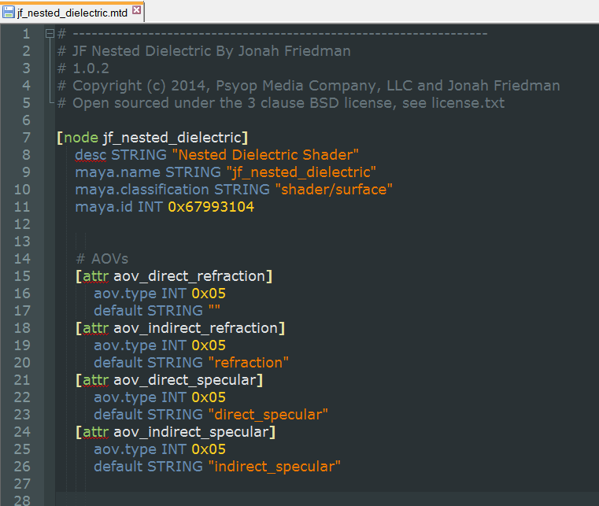

# Arnold Syntax Highlighter #
**Version 1.4** Released 2016-12-16  
by Andrew Hazelden

## Overview ##

I've just finished a set of Notepad++, GEDIT, BBEdit, and TextWrangler syntax highlighting modules for code from [Solid Angle's Arnold Renderer](http://www.solidangle.com/). The new modules make it easier for a VFX artist or technical director to edit an Arnold scene source file.

**New in Version 1.4** I've added most of the new syntax options for the 3ds Max MAXtoA version of Arnold.

**New in Version 1.3** I've added most of the new syntax options for the Cinema4D C4DtoA version of Arnold.

Here is an example Arnold Metadata .mtd file (`jf_nested_dielectric.mtd`) with syntax highlighting enabled:

* * * 

I hope this tool improves your coding workflow as you develop new Arnold Scene Source (.ASS) and Arnold Metadata (.MTD) files using a plain text editor.

Cheers,  
Andrew Hazelden

Email: [andrew@andrewhazelden.com](mailto:andrew@andrewhazelden.com)   
Blog: [http://www.andrewhazelden.com](http://www.andrewhazelden.com)  
Twitter: [@andrewhazelden](https://twitter.com/andrewhazelden)  
Google+: [https://plus.google.com/+AndrewHazelden](https://plus.google.com/+AndrewHazelden)
